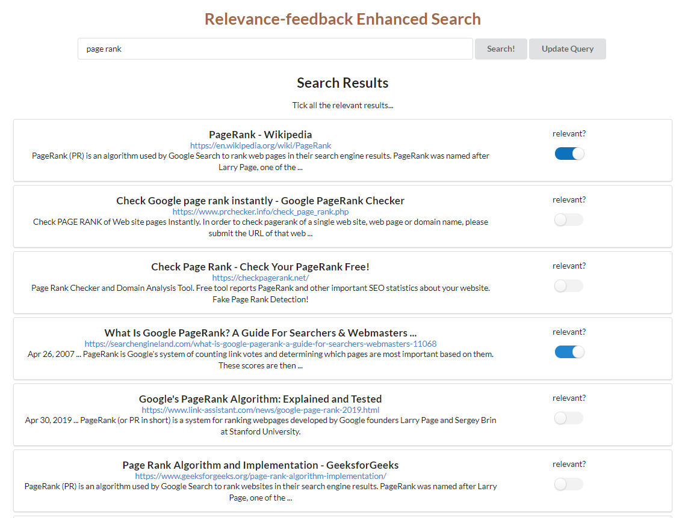

# Relevance feedback search portal

## Brief

A single page React application that allows interactive and algorithm-enhanced searching. 

The main page asks for a search query and presents the search results returned from Google. Then the user would tick all the results they consider relevant, and the query would be updated automatically, which would brings back more relevant search results.

The flask backend support RESTful API calls that accepts user's feedback on current searching results and return an improved query.

## Screenshot

